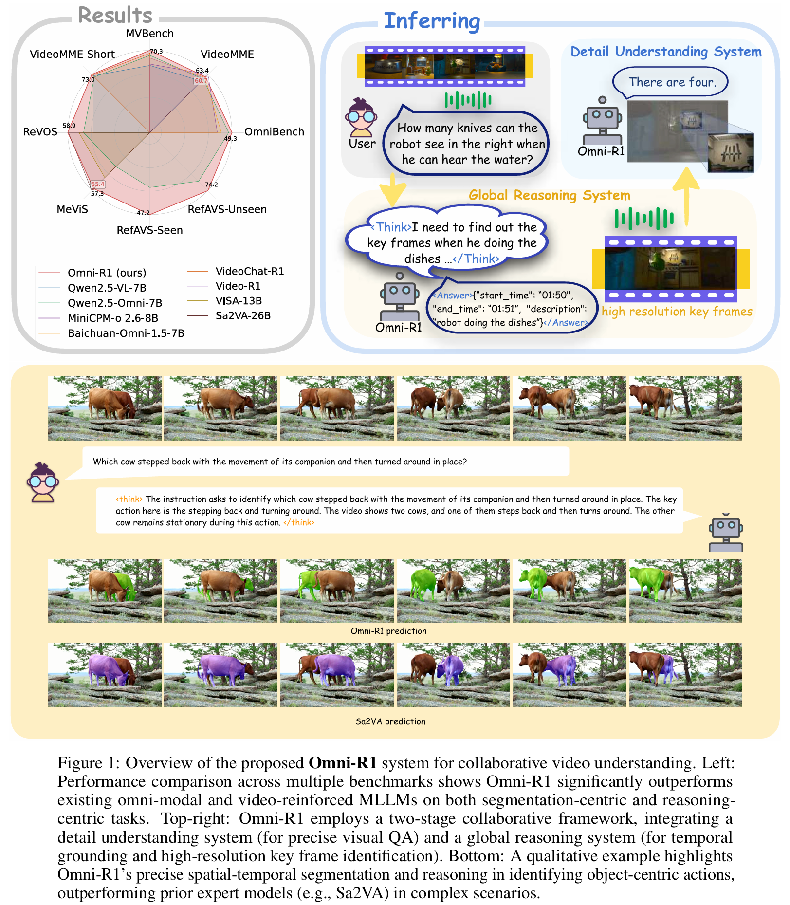

<div align="center">

# Omni-R1: Reinforcement Learning for Omnimodal Reasoning via Two-System Collaboration

Hao Zhong<sup>\*</sup>, &nbsp;
[Muzhi Zhu](https://scholar.google.com/citations?user=064gBH4AAAAJ&hl=zh-CN&oi=ao)<sup>*</sup>, &nbsp;
Zongze Du<sup>\*</sup>, &nbsp;
Zheng Huang<sup></sup>, &nbsp;
[Canyu Zhao](https://github.com/volcverse)<sup></sup>, &nbsp;
[Mingyu Liu](https://mingyulau.github.io/)<sup></sup>, &nbsp;
[Wen Wang](https://github.com/encounter1997)<sup></sup>, &nbsp;
[Hao Chen](https://scholar.google.com/citations?user=FaOqRpcAAAAJ)<sup></sup>, &nbsp;
[Chunhua Shen](https://cshen.github.io)<sup></sup>

[Zhejiang University](https://www.zju.edu.cn/english/)

*Equal contribution

[📄 **Paper**](https://arxiv.org/abs/2505.20256)&nbsp; | &nbsp;[🌐 **Project Page**](https://aim-uofa.github.io/OmniR1/) | &nbsp;[🤖 **Model Weights**](https://www.modelscope.cn/models/jxzh2020/Omni-R1) | &nbsp;[🤗 **Model Weights**](https://huggingface.co/Haoz0206/Omni-R1)
</div>


<!-- 🤖🤗 -->

## 🚀 Overview
<div align="center">

</div>

## 📖 Description

Video-audio reasoning and fine-grained pixel understanding impose conflicting requirements on
multimodal models: dense temporal coverage demands many low-resolution frames, whereas precise grounding
calls for high-resolution inputs. We tackle this trade-off with a <strong>two-system architecture</strong>: a <strong>Global Reasoning System</strong> selects informative keyframes and rewrites the task at low spatial cost,
while a <strong>Detail Understanding System</strong> performs pixel-level grounding on the selected high-resolution snippets.
Because optimal keyframe selection and reformulation are ambiguous and hard to supervise, we formulate them
as a reinforcement-learning (RL) problem and present <strong>Omni-R1</strong>, an end-to-end RL framework
built on Group Relative Policy Optimization.
<strong>Omni-R1</strong> trains the Global Reasoning System through hierarchical rewards obtained via online
collaboration
with the Detail Understanding System, requiring only one epoch of RL on small task splits.
Experiments on two challenging benchmarks, Referring Audio-Visual Segmentation (RefAVS) and Reasoning
Video
Object Segmentation (REVOS), show that Omni-R1 not only surpasses strong supervised baselines but also
outperforms specialized state-of-the-art models, while substantially improving out-of-domain
generalization
and mitigating multimodal hallucination.

Our results demonstrate the first successful application of RL to large-scale omnimodal reasoning and
highlight a scalable path toward universally foundation models.


## 🚩 Plan
<!-- - [ ] Release the weights. -->
- [X] Release model weights and demo.
- [ ] Release the segmentation and evaluation code.
- [ ] Release the training scripts.
<!-- --- -->


## 🛠️ Getting Started

### 📐 Set up Environment

```bash
git clone https://github.com/aim-uofa/Omni-R1
cd Omni-R1

# build environment
conda create -n omni python=3.10
conda activate omni

# install packages
pip install -r requirements.txt
pip install -e src/qwen-omni-utils[decord]
pip install flash-attn --no-build-isolation
pip install transformers/transformers_omni.zip

# replace transformers Qwen2.5-Omni .py file
bash replace_omni.sh
```

This project also supports `uv`, if preferred,

```bash
uv sync --no-build-isolation-package flash-attn
source .venv/bin/activate

# replace transformers Qwen2.5-Omni .py file
bash replace_omni.sh
```

### 📊 Download Datasets
Download and extract the datasets you need and prepare a `src/r1-v/datasets.json` according to `src/r1-v/datasets_demo.json`.

- ReVOS and MeVIS datasets are directly selected from [Sa2VA](https://github.com/magic-research/Sa2VA) training dataset, which can be downloaded [here](https://huggingface.co/datasets/Dense-World/Sa2VA-Training). Please refer to Sa2VA for usage.
- refCOCOg_2k_840 from [SegZero](https://github.com/dvlab-research/Seg-Zero) can be downloaded [here](https://huggingface.co/datasets/Ricky06662/refCOCOg_2k_840).
- [RefAVS](https://gewu-lab.github.io/Ref-AVS/) can be downloaded [here](https://zenodo.org/records/12970978/files/RefAVSBench.tar.gz?download=1)

### 🏋️ Training

```bash
# for uv, source .venv/bin/activate
conda activate omni

# start SAM server first. If not training VOS or alpha_g is set to 0.0, then SAM server is not necessary.
bash src/scripts/run_sam_server.sh

# start training, by default this script does not need a SAM server.
bash src/scripts/omni_r1_run_training.sh
```
To connect to an existing SAM server, you can set up `SAM_HOST` and `SAM_PORT` as environment variables in `src/scripts/omni_r1_run_training.sh`.


## 🔍 Inference
Inference code and evaluation code coming soon.

```python
import torch
from transformers import (
    Qwen2_5OmniModel,
    Qwen2_5OmniProcessor,
    GenerationConfig,
    Qwen2_5OmniThinkerForConditionalGeneration,
)
from transformers import AutoModelForCausalLM, AutoTokenizer
from qwen_omni_utils import process_mm_info, process_vision_info


omni_path = "/path/to/Omni-R1"

# Omni-R1 is Qwen2_5OmniThinker, not Qwen2_5OmniModel, so inference code is different from that of Qwen offical codes.
model = Qwen2_5OmniThinkerForConditionalGeneration.from_pretrained(
    omni_path,
    device_map="auto",
    torch_dtype=torch.bfloat16,
    attn_implementation="flash_attention_2",
).eval()
processor = Qwen2_5OmniProcessor.from_pretrained(omni_path)


generation_config = GenerationConfig(
    use_cache=True, max_new_tokens=1024, do_sample=False
)

def inference(video_path, prompt, sys_prompt):
    messages = [
        {"role": "system", "content": [{"type": "text", "text": sys_prompt}]},
        {
            "role": "user",
            "content": [
                {"type": "video", "video": video_path},
                {"type": "text", "text": prompt},
            ],
        },
    ]
    text_input = processor.apply_chat_template(
        messages, tokenize=False, add_generation_prompt=True
    )

    audio_input, image_input, video_input, process_args = process_mm_info(
        messages, use_audio_in_video=False
    )

    inputs = processor(
        text=text_input,
        images=image_input,
        audios=audio_input,
        videos=video_input,
        return_tensors="pt",
        do_resize=True,
    )

    # 生成输出
    with torch.inference_mode():
        generated_ids = model.generate(**inputs, generation_config=generation_config)

    prompt_length = inputs["input_ids"].size(1)
    completion_ids = generated_ids[:, prompt_length:]
    # Decode the generated completions
    text = processor.batch_decode(completion_ids, skip_special_tokens=True)
    return text

video_path = "https://qianwen-res.oss-cn-beijing.aliyuncs.com/Qwen2.5-Omni/shopping.mp4"
prompt = "How many kind of drinks can you see in the video?"

## Use a local model to inference.
response = inference(
    video_path, prompt=prompt, sys_prompt="You are a helpful assistant."
)
print(response[0])

```


## 🎫 License

For academic usage, this project is licensed under [the 2-clause BSD License](LICENSE). For commercial inquiries, please contact [Chunhua Shen](mailto:chhshen@gmail.com).

## 🙏 Acknowledgements

We sincerely appreciate the contributions of the open-source community. The related projects are as follows: [Sa2VA](https://github.com/magic-research/Sa2VA), [Video-R1](https://github.com/tulerfeng/Video-R1), [R1-V](https://github.com/Deep-Agent/R1-V) , [DeepSeek-R1](https://github.com/deepseek-ai/DeepSeek-R1) 


## 🖊️ Citation

If you find this work helpful for your research, please cite:

```BibTeX
@misc{zhong2025omnir1reinforcementlearningomnimodal,
      title={Omni-R1: Reinforcement Learning for Omnimodal Reasoning via Two-System Collaboration}, 
      author={Hao Zhong and Muzhi Zhu and Zongze Du and Zheng Huang and Canyu Zhao and Mingyu Liu and Wen Wang and Hao Chen and Chunhua Shen},
      year={2025},
      eprint={2505.20256},
      archivePrefix={arXiv},
      primaryClass={cs.CV},
      url={https://arxiv.org/abs/2505.20256}, 
}
```